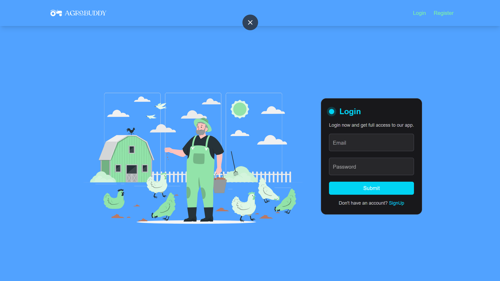
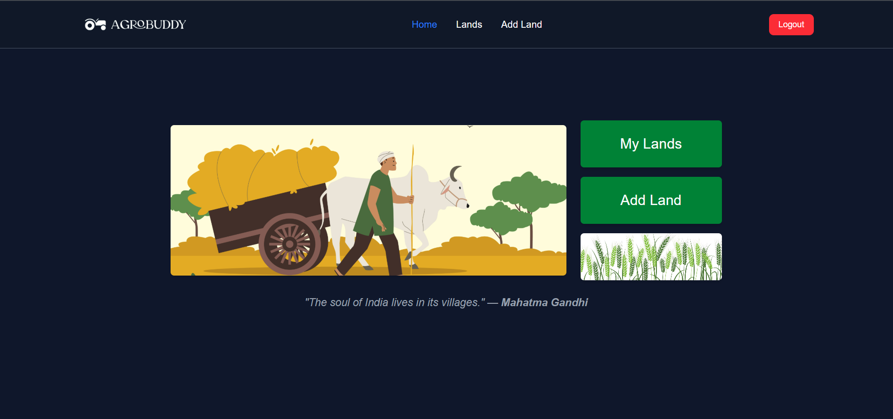
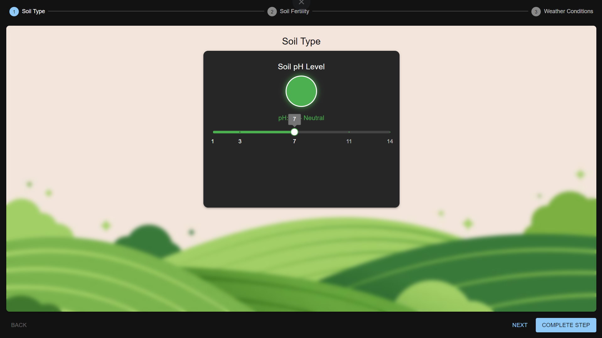
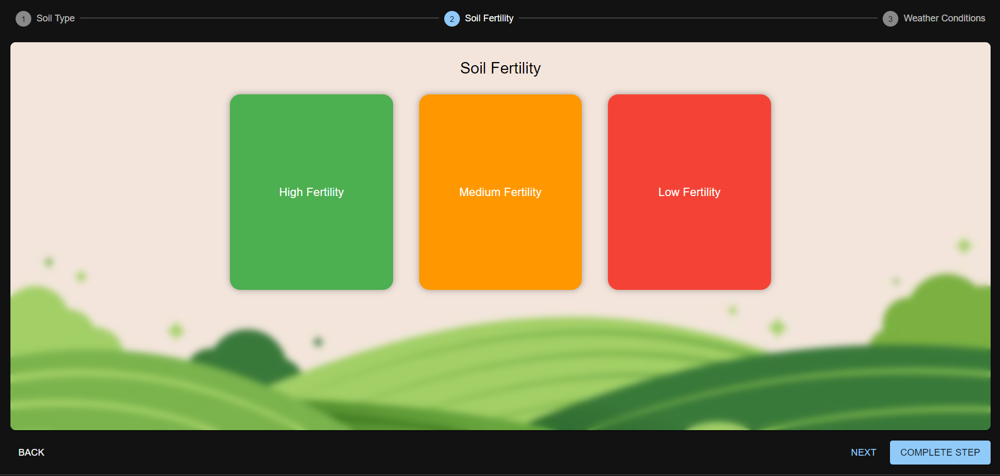
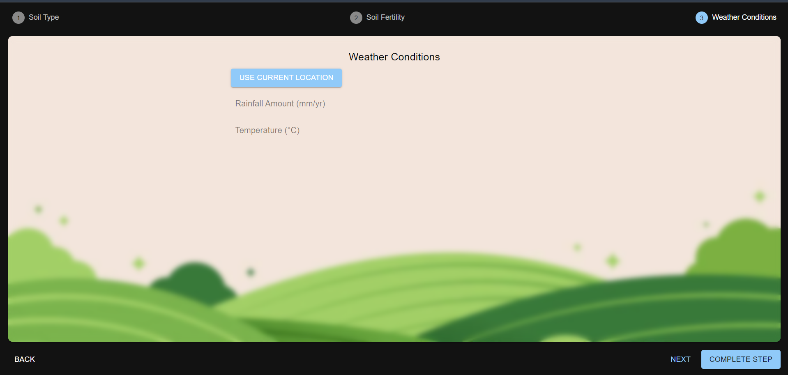
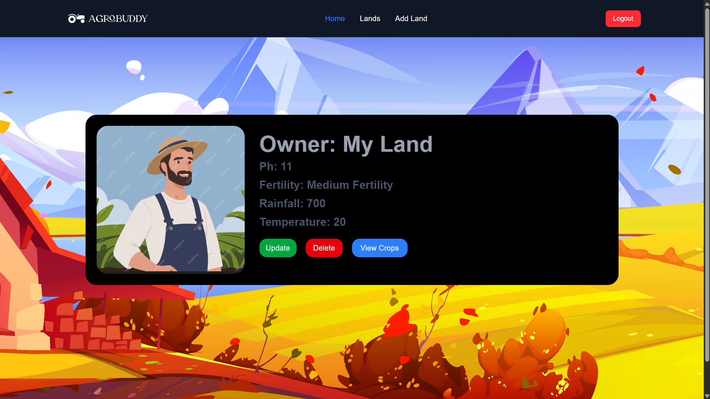
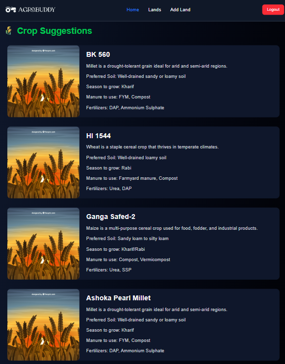

# 🌾 Crop Suggestion Web App

A modern web application that helps farmers get crop suggestions based on soil type, fertility, rainfall, and temperature. Built using **React**, **Firebase Authentication**, **Express.js**, **MongoDB**, and **Zustand** for state management.

## 🚀 Features

-  User Authentication (Firebase)
-  Crop Suggestions
-  Multi-step soil and weather input form
-  Land management (Add, Edit, Delete)
-  crop recommendations with image cards
-  State persistence using Zustand + localStorage
-  Protected routes and role-based rendering

---

## 🛠 Tech Stack

### Frontend:
- React + Vite
- Tailwind CSS + MUI (Stepper, Buttons)
- Zustand (State Management)
- Axios
- React Router
- Firebase Auth

### Backend:
- Node.js + Express.js
- MongoDB + Mongoose

---

